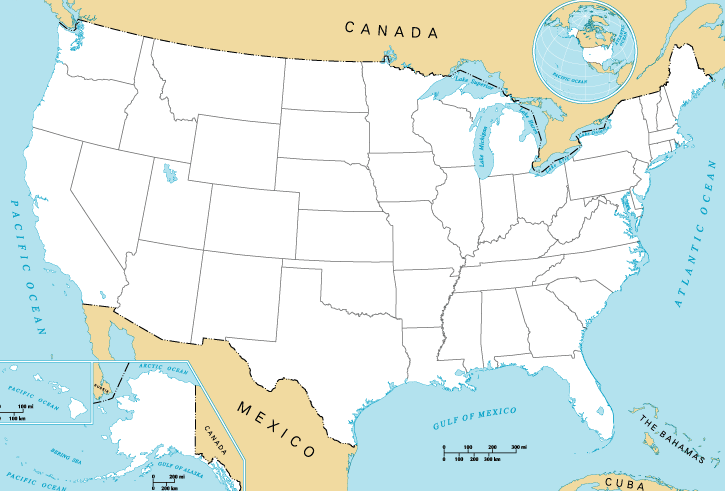

# U.S. States Guessing Game

This project is a simple interactive game that helps users learn the names and locations of U.S. states. It uses Python's Turtle graphics library for visualization and pandas for data handling.

## How It Works
- The game displays a blank map of the United States.
- The user is prompted to guess the name of a U.S. state.
- If the guess is correct, the state name is displayed on the map at its correct location.
- If the guess is incorrect, the game ends and displays a "GAME OVER" message.

## Features
- Interactive graphical interface using Turtle graphics.
- Reads state names and coordinates from a CSV file (`50_states.csv`).
- Displays correct guesses on the map at their respective coordinates.
- Ends the game on an incorrect guess.

## File Structure
- `main.py`: Main game logic.
- `states_turtle.py`: Contains the `State_location` class for displaying state names and messages.
- `50_states.csv`: CSV file with state names and their x/y coordinates.
- `blank_states_img.gif`: Image of a blank U.S. map used as the game background.

## How to Run
1. Make sure you have Python installed (preferably 3.7+).
2. Install the required packages:
   ```bash
   pip install pandas
   ```
3. Run the game:
   ```bash
   python main.py
   ```

## Code Overview
- Loads state data from `50_states.csv` using pandas.
- Sets up the Turtle graphics window and background image.
- Prompts the user to enter state names in a loop.
- Displays correct guesses on the map using the `State_location` class.
- Ends the game and displays a message if the guess is incorrect.

## Example


## Credits
- Map image and state data from [50_states.csv].
- Built with Python, Turtle, and pandas.

---

Feel free to modify or extend the game to add more features, such as tracking the number of correct guesses, preventing duplicate guesses, or allowing the user to exit gracefully.
